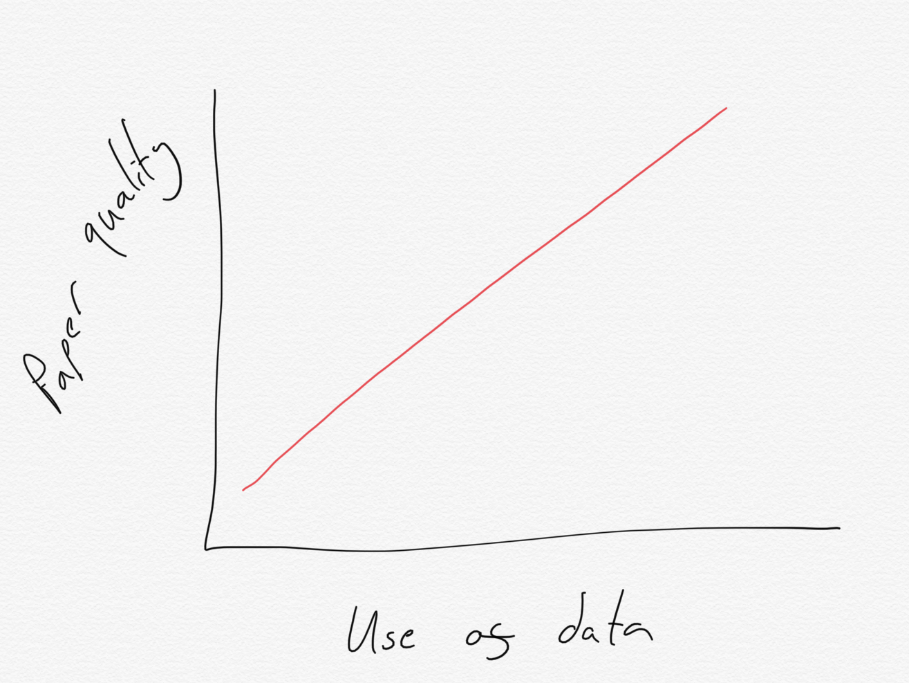

```{r setup, echo=FALSE, message=FALSE}
# Set global options for chunks
knitr::opts_chunk$set(echo = FALSE) # By default, do not show R code

# Load libraries required for analysis
library(stargazer) # v5.2.2

# Load data required for analysis
covid_data <- read.csv("data/covid_survey.csv")

```

# Introduction

The important thing about academic papers is that you state your argument *very clearly* at the beginning of the introduction. Even if you think your argument is clear, there are certainly ways that you can make it **even clearer**. Often, the way to maximise clarity is to treat your audience as if they are really stupid, and to present your arguments in a list:

* You should be clear
* No, clearer than that
* Are you listening to me? Clarity is everything.

Or, even, as an *ordered* list:

1. One thing
2. Another thing
3. A third thing

If you are writing a paper, another important thing to clarify in your introduction is how you contribute to some important and extensive literature. For instance you might want to write about exciting work in electoral politics [@blumenau2017open], legislative politics [@blumenau2018never]; or even politics and gender [@blumenau2019effects].[^alternatives] Alternatively, you might want to provide a link to a [very interesting online resource](https://www.jackblumenau.com) that is relevant to your work.

[^alternatives]: I can use this footnote to tell you that other authors are available. 

<!--- This is how you write a comment in Rmarkdown. For instance, I might leave a comment here asking "will people think I am being serious about citing myself all the time or will they understand that I am making a joke?" --->

# Good papers have good sections

In addition, most good papers use a lot of math.

$$ Y_i = \alpha + \beta X_i + \epsilon_i $$

Sometimes you might not want to include a big equation like this, but instead just add a quick equation in-line with the text like this: $\frac{1}{2} = .5$. Sometimes you might not want to include math at all, but instead a more user-friendly graph. That's easy too. For instance, figure \ref{silly_graph} shows a graph I created to explain what makes for a good paper.



# Data and methods

## Data

Of course, while good papers might use math, the best papers use *data*. You can load the data that I provided by writing the following in R:

```{r echo=TRUE, eval = FALSE}

## Load data
covid_data <- read.csv("data/covid_survey.csv")

```


This data includes responses from from a survey of `r nrow(covid_data)` individuals which was fielded in March 2020. We will focus on information on `r ncol(covid_data)` questions posed to those individuals. Our primary interested is in the responses provided to the following questions:

1. `incomeChangeHH`

    - Has your household monthly income changed since the coronavirus outbreak?

2. `approveUKGovt`

    - Do you approve or disapprove of the job that the UK government is doing?

We will use this data to see how Rmarkdown can 1) make it easier to change your paper as you make changes to your analysis; and 2) make it easier to replicate your analysis.

## Methods

In this section you should include the R code that you wrote at home in a code chunk in this document.

For instance, you might want to create a plot like this:

```{r}

hist(covid_data$age)

```

Or a table, using the `stargazer` package, like this:

```{r, results='asis'}

silly_model <- lm(age ~ profile_gender,covid_data)

stargazer(silly_model,
          header = FALSE)

```

# References